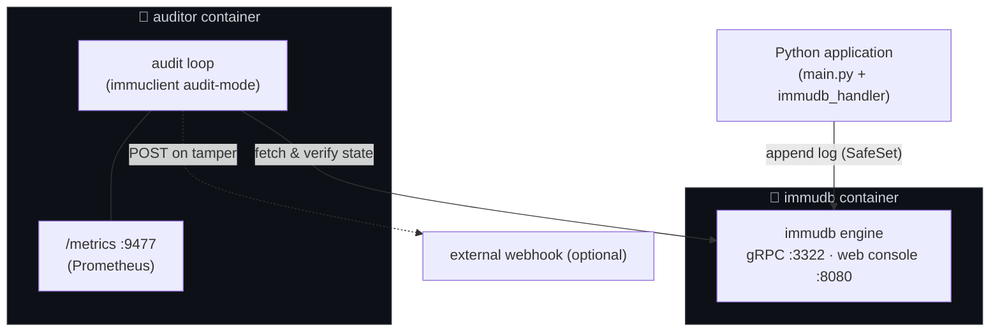
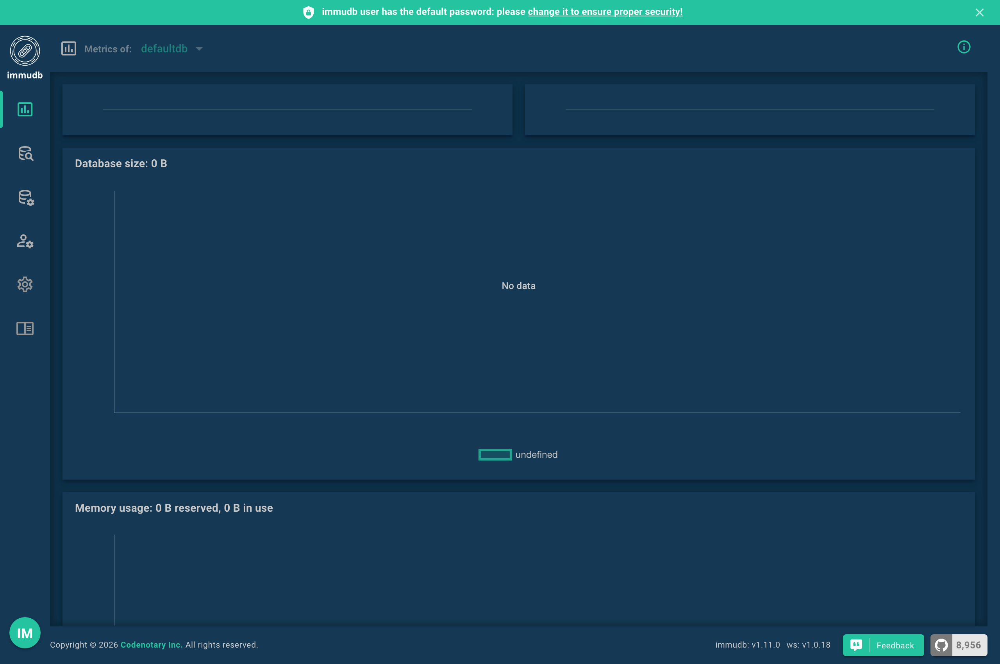

# immutable-logging for Python

This project demonstrates a **production-ready, immutable logging system** using [immudb](https://immudb.io/), an open-source cryptographically verifiable database. Logs are stored in an append-only, tamper-evident database while optionally also being written to local files. This ensures **full auditability, traceability, and integrity** of all application events.

<p align="center">
  
</p>


---

## Features

- **Immutable Logging**: All log entries are stored in immudb with cryptographic verification.
- **Native Python Logging Levels**: Supports `DEBUG`, `INFO`, `WARNING`, `ERROR`, and `CRITICAL`.
- **Exception Logging**: Automatically captures exceptions and tracebacks.
- **Dual Output**: Logs can be stored in immudb **and** written to a rotating file for easy inspection.
- **Thread-Safe & Non-blocking**: Uses a queue and background worker to prevent application slowdowns.
- **Docker-Ready**: Runs immudb (and the auditor) as standard Docker containers on a shared network.
- **Pretty-Printed Output**: Human-readable display of immudb log entries.
- **Tamper-Proof File Logs**: SHA-256 hash chain written to a `.integrity` sidecar file detects modifications, deletions, and insertions.
- **Graceful immudb Fallback**: Works without immudb — falls back to file + console logging, retries connection every 30 seconds.
- **Log Integrity Verification**: CLI tool and startup check to verify log file integrity.
- **Tampering Detection (immudb Auditor)**: Independent `immuclient audit-mode` container periodically verifies immudb's cryptographic state and exposes Prometheus metrics.

---

## How It Works

1. Log messages are generated using Python’s standard logging module.
2. Each log record is serialized with metadata, including:
   - Timestamp
   - Logger name
   - File and line number
   - Function name
   - Log level
3. Records are sent to immudb, where:
   - Each write is **append-only**.
   - Updates create new versions while preserving the full historical record.
   - Cryptographic proofs ensure tamper-evidence.
4. Optionally, logs are also written to a local file using a rotating file handler.
5. A SHA-256 hash chain is written to a `.integrity` sidecar file. Each entry's hash covers its full content plus the previous hash, forming a tamper-evident chain that can be independently verified.

---

## Benefits

- **Auditability**: Every event can be independently verified.
- **Traceability**: Complete history of changes is preserved.
- **Compliance**: Suitable for systems requiring strict data integrity standards.
- **Flexible**: Language-agnostic logging pattern; applications only need to append events.

---

## Getting Started

### Prerequisites

- Docker
- Python 3.11+
- pip

### Run immudb with Docker

Create a shared network so the auditor (added later) can reach immudb by name, then start immudb with its gRPC and web console ports exposed:

```bash
docker network create immudb-net
docker run -d --network immudb-net --name immudb \
  -p 3322:3322 -p 8080:8080 \
  codenotary/immudb:latest
```

### Install requirements  

```bash
pip install -r requirements.txt
```

### Run the application
```bash
python main.py
```

## Log sinks
- Logs are stored in immudb:
```bash
--- Latest immudb logs ---
[2026-03-31 11:05:55.026] DEBUG    Debug details for developers
    Logger: CVDLINK test logger
    File:   main.py:50
    Func:   main
    Key:    log:1774944355026:DEBUG

[2026-03-31 11:05:55.027] CRITICAL System failure
    Logger: CVDLINK test logger
    File:   main.py:54
    Func:   main
    Key:    log:1774944355027:CRITICAL

[2026-03-31 11:05:55.027] ERROR    Database connection timeout
    Logger: CVDLINK test logger
    File:   main.py:53
    Func:   main
    Key:    log:1774944355027:ERROR

[2026-03-31 11:05:55.027] INFO     Service started
    Logger: CVDLINK test logger
    File:   main.py:51
    Func:   main
    Key:    log:1774944355027:INFO

[2026-03-31 11:05:55.027] WARNING  Memory usage near threshold
    Logger: CVDLINK test logger
    File:   main.py:52
    Func:   main
    Key:    log:1774944355027:WARNING

[2026-03-31 11:05:55.028] ERROR    Unhandled exception occurred
    Logger: CVDLINK test logger
    File:   main.py:60
    Func:   main
    Key:    log:1774944355028:ERROR

```
- Rotating file logs are saved to **cvdlink.log**:
```bash
2026-03-31 11:11:08,615 [DEBUG] CVDLINK test logger (main.py:50): Debug details for developers
2026-03-31 11:11:08,616 [INFO] CVDLINK test logger (main.py:51): Service started
2026-03-31 11:11:08,616 [WARNING] CVDLINK test logger (main.py:52): Memory usage near threshold
2026-03-31 11:11:08,616 [ERROR] CVDLINK test logger (main.py:53): Database connection timeout
2026-03-31 11:11:08,616 [CRITICAL] CVDLINK test logger (main.py:54): System failure
2026-03-31 11:11:08,616 [ERROR] CVDLINK test logger (main.py:60): Unhandled exception occurred
Traceback (most recent call last):
  File "c:\src\Projects\immutable_logging\main.py", line 58, in main
    1 / 0
    ~~^~~
ZeroDivisionError: division by zero
```

## Running Tests

The test suite uses only the standard library (`unittest`) and mocks the immudb client, so **no running immudb instance is required**.

```bash
python -m pytest test_immudb_handler.py test_integrity_handler.py test_verify_logs.py -v
```

---

## Tamper-Proof Logging

Each log entry's full content (timestamp, level, logger, file, line, message) is hashed with SHA-256 and chained to the previous entry's hash — similar to how Git links commits. The hash chain is stored in a sidecar `.integrity` file alongside the main log.

**`cvdlink.log`** stays human-readable and unchanged:
```bash
2026-04-09 10:00:01,123 [INFO] CVDLINK test logger (main.py:51): Service started
2026-04-09 10:00:01,124 [DEBUG] CVDLINK test logger (main.py:50): Debug details
```

**`cvdlink.log.integrity`** stores the hash chain:
```bash
1|sha256=a3f2b8c1...|prev=0000000000000000000000000000000000000000000000000000000000000000
2|sha256=7e1d4af2...|prev=a3f2b8c1...
```

If anyone modifies, deletes, or inserts a log entry, the chain breaks and verification catches it.

## Verifying Log Integrity

### CLI verification
```bash
python verify_logs.py cvdlink.log
```

**Clean output:**
```bash
Verifying cvdlink.log...
Line 1: OK
Line 2: OK
Line 3: OK

Result: PASSED — all entries verified
```

**Tampered output:**
```bash
Verifying cvdlink.log...
Line 1: OK
Line 2: TAMPERED
Line 3: OK

Result: FAILED — 1 tampered, 0 missing entries
```

### Startup verification
The application automatically checks log integrity on startup and logs the result:
```bash
2026-04-09 10:00:00,000 [INFO] CVDLINK test logger: Log integrity check passed.
```

## Graceful immudb Fallback

The system works without immudb running. If immudb is unreachable:
1. A warning is printed: `immudb connection failed: <reason>. Falling back to file-only logging.`
2. Logs continue to file (`cvdlink.log`), integrity sidecar (`.integrity`), and console (stderr).
3. A background thread retries the connection every 30 seconds.
4. When immudb becomes available, logging resumes to immudb automatically.

## Tampering Detection with the immudb Auditor

immudb's append-only writes are tamper-*evident*, but only if **someone checks**. The [immudb Auditor](https://docs.immudb.io/master/production/auditor.html) is a separate `immuclient audit-mode` process that periodically asks immudb for its current cryptographic state, compares it to the previous state, and verifies the Merkle proof linking them. If anyone — including a privileged operator — rewrites history in immudb's storage, the proof breaks and the auditor flags it.

Run the auditor as an independent container so a compromise of the application or the immudb host does not silently compromise verification.

### Architecture

The auditor runs **in its own container**, separate from immudb and from the application. That isolation is the point — if the immudb host (or its operator) is compromised, an auditor running elsewhere still notices and complains. All three containers talk over a shared Docker network (`immudb-net` in this project).



> Container images: `codenotary/immudb:latest` and `codenotary/immuclient:latest`. The Python application can run on the host or in its own container; the auditor only needs network reach to immudb.

The auditor never writes to immudb — it only reads `currentState` and runs the Merkle consistency check between the previous and current root.

### Setup

If you already ran [Getting Started](#run-immudb-with-docker), immudb is on `immudb-net` — skip ahead to the auditor command. Otherwise create the network and immudb container first:

```bash
docker network create immudb-net   # skip if already created
docker run -d --network immudb-net --name immudb \
  -p 3322:3322 -p 8080:8080 \
  codenotary/immudb:latest
```

Start the auditor on the same network (Prometheus metrics on `:9477`):

```bash
docker run -d --network immudb-net --name auditor \
  -p 9477:9477 \
  -e IMMUCLIENT_IMMUDB_ADDRESS=immudb \
  -e IMMUCLIENT_IMMUDB_PORT=3322 \
  -e IMMUCLIENT_AUDIT_USERNAME=immudb \
  -e IMMUCLIENT_AUDIT_PASSWORD=immudb \
  -e IMMUCLIENT_AUDIT_MONITORING_HOST=0.0.0.0 \
  -e IMMUCLIENT_AUDIT_MONITORING_PORT=9477 \
  codenotary/immuclient:latest audit-mode
```

Generate some logs so the auditor has something to verify:

```bash
python main.py
```

Watch the auditor work:

```bash
docker logs -f auditor
curl -s http://localhost:9477/metrics | grep immuclient_audit_
```

### Auditor in action

The auditor performs an audit every minute (configurable via `IMMUCLIENT_AUDIT_INTERVAL`). It skips empty databases (`audit canceled: database is empty`) until something has been written. The first audit that actually runs just records the current state — it has nothing to compare against. From the next audit onward it asks immudb for a Merkle consistency proof between the previous root and the current root; that's the real tamper check, and it's what flags any rewrite of history.

<p align="center">
  
</p>

```text
immuclientd INFO: audit #1 - auditing database defaultdb
immuclientd WARNING: audit #1 canceled: database is empty on server ... @ immudb:3322
immuclientd INFO: audit #2 finished in 107.97ms @ 2026-05-05T15:59:38Z
immuclientd INFO: audit #3 result:
 db: defaultdb, consistent: true previous state: 3e6ad3f99f2b2ea7b37c9ac3ef291d72a08184ee2868204cbcd899fd8bdcd8a9 at tx: 2
  current state:           3e6ad3f99f2b2ea7b37c9ac3ef291d72a08184ee2868204cbcd899fd8bdcd8a9 at tx: 2
immuclientd INFO: audit #3 finished in 111.02ms
```

### Key metrics

The auditor exposes Prometheus metrics on `:9477/metrics`. The four to watch:

| Metric | Meaning |
| --- | --- |
| `immuclient_audit_result_per_server` | **`1` = verified, `0` = tampered.** Alert on `== 0`. |
| `immuclient_audit_run_at_per_server` | Unix timestamp of the last audit. Alert if it stops advancing — the auditor is dead. |
| `immuclient_audit_curr_root_per_server` | Current Merkle root index (transaction id). |
| `immuclient_audit_prev_root_per_server` | Merkle root from the previous audit. |

```text
immuclient_audit_result_per_server{server_address="immudb:3322",server_id="..."} 1
immuclient_audit_run_at_per_server{server_address="immudb:3322",server_id="..."} 1.7779968983e+09
immuclient_audit_curr_root_per_server{server_address="immudb:3322",server_id="..."} 2
immuclient_audit_prev_root_per_server{server_address="immudb:3322",server_id="..."} 2
```

### immudb web console

immudb ships a web UI at `http://localhost:8080` (login `immudb` / `immudb`). It's useful for browsing the database and watching infrastructure metrics, but the actual tamper check is the auditor's job.

<p align="center">
  
</p>

### Production hardening

- **Run multiple auditors** in different zones — one auditor can itself be compromised; independent attestation needs independent observers.
- **Set `IMMUCLIENT_AUDIT_NOTIFICATION_URL`** to a webhook you actually monitor. Without it, a tamper alert just sits in container logs.
- **Use a read-only audit user** instead of the default `immudb` admin credentials.
- **Alert on `immuclient_audit_result_per_server == 0`** *and* on `immuclient_audit_run_at_per_server` going stale — both failure modes matter.

Reference: [immudb auditor docs](https://docs.immudb.io/master/production/auditor.html).
