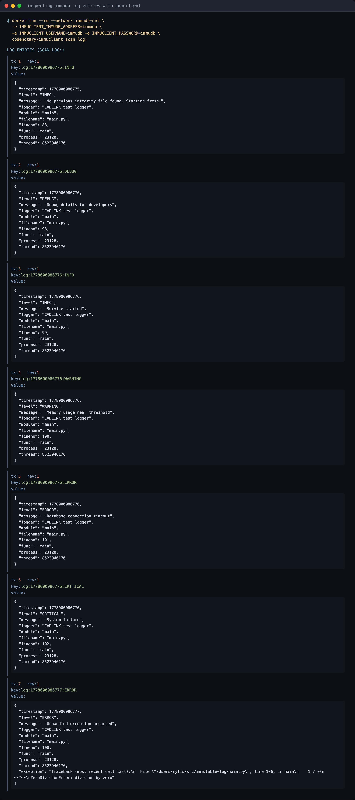
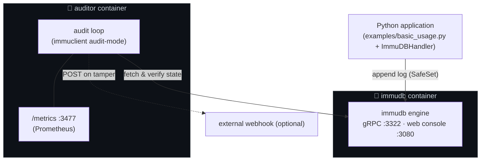
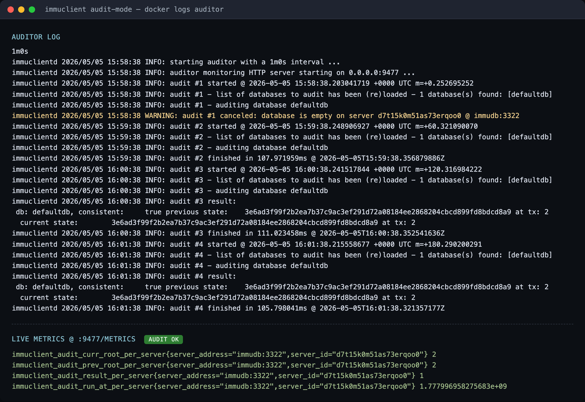

# immutable-logging for Python

This project demonstrates a **production-ready, immutable logging system** in Python. It can be used in two ways: as a **standalone library** (rotating file logs with a tamper-evident SHA-256 hash chain) or **with [immudb](https://immudb.io/)** (every log written to a cryptographically verifiable, append-only database, with an optional independent auditor).

<p align="center">
  
</p>

---

## Installation

Install the base package (hash-chain integrity, stdlib only):

```bash
pip install git+https://github.com/rytisss/immutable-logging
```

To also use the immudb handler, install with the `immudb` extra:

```bash
pip install 'immutable_logging[immudb] @ git+https://github.com/rytisss/immutable-logging'
```

### Install from a local clone

If you already have the source checked out, install from the project root:

```bash
git clone https://github.com/rytisss/immutable-logging
cd immutable-logging
pip install .
```

With the `immudb` extra:

```bash
pip install '.[immudb]'
```

For development, use an editable install so code changes take effect without reinstalling:

```bash
pip install -e '.[immudb]'
```

After install, the public API is:

```python
from immutable_logging import (
    IntegrityHandler,                # SHA-256 hash chain to a .integrity sidecar
    IntegrityRotatingFileHandler,    # rotating file handler with built-in chain
    SingleLineFormatter,             # escapes newlines so one record == one log line
    ImmuDBHandler,                   # immudb backend (needs [immudb] extra)
    verify_log_integrity,            # programmatic verification
    VerifyResult,                    # result dataclass with .passed and .summary
)
```

Pick the right file handler:

- **No rotation** — use `IntegrityHandler` alongside your own `FileHandler` (see [`examples/minimal_usage.py`](examples/minimal_usage.py)).
- **With rotation** — use `IntegrityRotatingFileHandler` on its own; it writes the log and the `.integrity` sidecar together and rotates both in lockstep so each rotated pair (`app.log.N` + `app.log.N.integrity`) verifies independently (see [`examples/basic_usage.py`](examples/basic_usage.py) and the stress demo at [`examples/rotation_usage.py`](examples/rotation_usage.py)).

> **Always pair `IntegrityHandler` with `SingleLineFormatter`** (applied to *both* the integrity handler and the file handler). The verifier reads the log file one line per entry, so a multi-line record — like an exception traceback — would otherwise break the chain. `SingleLineFormatter` escapes `\n`/`\r`/`\\` so each record stays on one line.

A CLI is also installed:

```bash
verify-logs path/to/app.log
```

---

## Two ways to use it

| Mode | What you get | What you need |
| --- | --- | --- |
| **A · Standalone** | Rotating file logs + SHA-256 hash chain in a `.integrity` sidecar. Tamper-evident and independently verifiable. | Just Python. No database, no Docker. |
| **B · With immudb** | Mode A *plus* every log written to immudb (append-only, cryptographically verifiable). | Mode A + an immudb container. |
| **B+ · With auditor** | Mode B *plus* an independent process that periodically verifies immudb's cryptographic state. | Mode B + an auditor container. |

The same `python examples/basic_usage.py` works for all three — the immudb handler [falls back gracefully](#graceful-fallback) when no database is reachable, so you can start in Mode A and add immudb later without touching code.

## Features

**Always on (Mode A and up):**
- Native Python logging levels (`DEBUG`, `INFO`, `WARNING`, `ERROR`, `CRITICAL`).
- Exception and traceback capture.
- Rotating file logs.
- SHA-256 hash chain written to a `.integrity` sidecar — modifications, deletions, and insertions are detected.
- CLI tool and startup check for log integrity verification.

**With immudb (Mode B and up):**
- Every log entry written to immudb in append-only, cryptographically verifiable form.
- Thread-safe and non-blocking — uses a queue and background worker.
- Graceful fallback if immudb is unreachable; logging resumes automatically when it returns.
- Optional independent auditor (Mode B+) that periodically verifies immudb's state and exposes Prometheus metrics.

**Default ports** (all in the `3000–3999` range):

| Port | Used by | Notes |
| --- | --- | --- |
| `3322` | immudb gRPC | App and auditor talk to immudb here. |
| `3080` | immudb web console | Mapped from the container's internal `8080`. |
| `3477` | Auditor `/metrics` | Prometheus endpoint. |

---

## Mode A — Standalone (no database)

The simplest way to use it: file logs with a tamper-evident hash chain. No Docker, no database.

### Run

```bash
python examples/basic_usage.py
```

You'll get two files: `cvdlink.log` and `cvdlink.log.integrity`.

For the absolute simplest setup — no rotation, no immudb — see [`examples/minimal_usage.py`](examples/minimal_usage.py).

### What gets written

`cvdlink.log` (rotating, human-readable):

```text
2026-03-31 11:11:08,615 [DEBUG] CVDLINK test logger (basic_usage.py:50): Debug details for developers
2026-03-31 11:11:08,616 [INFO] CVDLINK test logger (basic_usage.py:51): Service started
2026-03-31 11:11:08,616 [WARNING] CVDLINK test logger (basic_usage.py:52): Memory usage near threshold
2026-03-31 11:11:08,616 [ERROR] CVDLINK test logger (basic_usage.py:53): Database connection timeout
2026-03-31 11:11:08,616 [CRITICAL] CVDLINK test logger (basic_usage.py:54): System failure
```

`cvdlink.log.integrity` (hash chain, machine-readable):

```text
1|sha256=a3f2b8c1...|prev=0000000000000000000000000000000000000000000000000000000000000000
2|sha256=7e1d4af2...|prev=a3f2b8c1...
```

Each entry's hash covers its full content (timestamp, level, logger, file, line, message) **plus** the previous hash — similar to how Git links commits. Modify, delete, or insert a single line in `cvdlink.log` and the chain breaks at that point.

### Verifying the chain

Run the CLI verifier:

```bash
verify-logs cvdlink.log
```

**Clean output:**

```text
OK: 3 entries verified
```

**Tampered output:**

```text
FAILED: 2 tampered, 1 missing
  Tampered lines: 3, 6
  Missing lines:  7
```

The exit code is `0` on pass, `1` on FAILED, and `2` if the log file is missing — usable directly in CI / cron / startup checks.

For programmatic use, call `verify_log_integrity()` and inspect the `VerifyResult` fields (`passed`, `summary`, `tampered_lines`, `missing_lines`). A runnable end-to-end demo is at [`examples/verify_usage.py`](examples/verify_usage.py).

**Missing sidecar:**

```text
No previous integrity file found
```

The application also runs this check automatically at startup and reports the result through the logger:

```text
2026-04-09 10:00:00,000 [INFO] CVDLINK test logger: Log integrity check passed.
```

### What standalone mode does and doesn't give you

A hash chain on disk is enough to **detect** tampering — anyone with the log file and the verifier script can confirm whether it has been modified. It is **not** enough to prevent tampering by an attacker who can also rewrite the `.integrity` sidecar in place. For that, write to immudb (Mode B) so the chain is replicated to a separate, append-only store, or ship the integrity file off-box.

---

## Mode B — With immudb

immudb stores every log entry in an append-only, cryptographically verifiable database. Even an operator with disk access cannot rewrite history without breaking the cryptographic chain — and a separate auditor (Mode B+) will notice.

### Prerequisites

- Docker.
- Mode A already working — the immudb handler is layered on top of the file + hash-chain handler.

### Run immudb

Create a shared Docker network so the auditor (added in Mode B+) can reach immudb by name, then start immudb with the gRPC and web console ports exposed:

```bash
docker network create immudb-net
docker run -d --network immudb-net --name immudb \
  -p 3322:3322 -p 3080:8080 \
  codenotary/immudb:latest
```

- `3322` — gRPC, used by the app and the auditor.
- `3080` — web console (mapped from the container's internal `8080`).

### Run the application

Same command as in Mode A:

```bash
python examples/basic_usage.py
```

The app now writes each log entry to immudb in addition to the file + integrity sidecar.

### Inspecting log entries

Logs are stored as **key-value pairs** in immudb — keys like `log:<timestamp>:<LEVEL>`, values are the JSON-encoded log record. The web console at `http://localhost:3080` is useful for admin tasks and infrastructure metrics, but it doesn't browse K/V data, so to see actual entries use `immuclient`:

```bash
docker run --rm --network immudb-net \
  -e IMMUCLIENT_IMMUDB_ADDRESS=immudb \
  -e IMMUCLIENT_USERNAME=immudb \
  -e IMMUCLIENT_PASSWORD=immudb \
  codenotary/immuclient scan log:
```

<p align="center">
  
</p>

Each entry has a transaction id (`tx`), the key, and the JSON-encoded log record as the value. Use `safeget <key>` instead of `scan` to retrieve a single entry along with its cryptographic inclusion proof. The demo script also dumps the latest entries at the end of its run via `immu_handler.scan_logs(limit=6)`.

### Graceful fallback

The immudb handler doesn't fail loudly if immudb is unreachable:

1. A warning is printed: `immudb connection failed: <reason>. Falling back to file-only logging.`
2. Logs continue to file (`cvdlink.log`), integrity sidecar, and console.
3. A background thread retries the connection every 30 seconds.
4. When immudb becomes available, logging resumes to immudb automatically.

This means you can promote a deployment from Mode A to Mode B by starting an immudb container — no app restart required.

---

## Mode B+ — Tampering detection with the immudb Auditor

immudb's writes are tamper-*evident*, but only if **someone checks**. The [immudb Auditor](https://docs.immudb.io/master/production/auditor.html) is a separate `immuclient audit-mode` process that periodically asks immudb for its current cryptographic state, compares it to the previous state, and verifies the Merkle proof linking them. If anyone — including a privileged operator — rewrites history in immudb's storage, the proof breaks and the auditor flags it.

### Architecture

The auditor runs **in its own container**, separate from immudb and from the application. That isolation is the point — if the immudb host (or its operator) is compromised, an auditor running elsewhere still notices and complains. All three components share the same Docker network (`immudb-net`).



> Container images: `codenotary/immudb:latest` and `codenotary/immuclient:latest`. The Python application can run on the host or in its own container; the auditor only needs network reach to immudb.

The auditor never writes to immudb — it only reads `currentState` and runs the Merkle consistency check between the previous and current root.

### Setup

Pre-req: Mode B (immudb already running on `immudb-net`). Then start the auditor on the same network:

```bash
docker run -d --network immudb-net --name auditor \
  -p 3477:3477 \
  -e IMMUCLIENT_IMMUDB_ADDRESS=immudb \
  -e IMMUCLIENT_IMMUDB_PORT=3322 \
  -e IMMUCLIENT_AUDIT_USERNAME=immudb \
  -e IMMUCLIENT_AUDIT_PASSWORD=immudb \
  -e IMMUCLIENT_AUDIT_MONITORING_HOST=0.0.0.0 \
  -e IMMUCLIENT_AUDIT_MONITORING_PORT=3477 \
  codenotary/immuclient:latest audit-mode
```

Watch it work:

```bash
docker logs -f auditor
curl -s http://localhost:3477/metrics | grep immuclient_audit_
```

### Auditor in action

The auditor performs an audit every minute (configurable via `IMMUCLIENT_AUDIT_INTERVAL`). It skips empty databases (`audit canceled: database is empty`) until something has been written. The first audit that actually runs just records the current state — there's nothing to compare against. From the next audit onward it asks immudb for a Merkle consistency proof between the previous root and the current root; that's the real tamper check, and it's what flags any rewrite of history.

<p align="center">
  
</p>

```text
immuclientd INFO: auditor monitoring HTTP server starting on 0.0.0.0:3477 ...
immuclientd WARNING: audit #1 canceled: database is empty on server ... @ immudb:3322
immuclientd INFO: audit #4 finished in 145.55ms @ 2026-05-05T16:30:52Z
immuclientd INFO: audit #5 result:
 db: defaultdb, consistent: true previous state: 3f4dd9e794177ac49a922e5854b317e784b26b29833b8490f78f0cb2f60132f9 at tx: 1
  current state:           3f4dd9e794177ac49a922e5854b317e784b26b29833b8490f78f0cb2f60132f9 at tx: 1
```

### Key metrics

The auditor exposes Prometheus metrics on `:3477/metrics`. The four to watch:

| Metric | Meaning |
| --- | --- |
| `immuclient_audit_result_per_server` | **`1` = verified, `0` = tampered.** Alert on `== 0`. |
| `immuclient_audit_run_at_per_server` | Unix timestamp of the last audit. Alert if it stops advancing — the auditor is dead. |
| `immuclient_audit_curr_root_per_server` | Current Merkle root index (transaction id). |
| `immuclient_audit_prev_root_per_server` | Merkle root from the previous audit. |

```text
immuclient_audit_result_per_server{server_address="immudb:3322",server_id="..."} 1
immuclient_audit_run_at_per_server{server_address="immudb:3322",server_id="..."} 1.7779987125e+09
immuclient_audit_curr_root_per_server{server_address="immudb:3322",server_id="..."} 1
immuclient_audit_prev_root_per_server{server_address="immudb:3322",server_id="..."} 1
```

### Production hardening

- **Run multiple auditors** in different zones — one auditor can itself be compromised; independent attestation needs independent observers.
- **Set `IMMUCLIENT_AUDIT_NOTIFICATION_URL`** to a webhook you actually monitor. Without it, a tamper alert just sits in container logs.
- **Use a read-only audit user** instead of the default `immudb` admin credentials.
- **Alert on `immuclient_audit_result_per_server == 0`** *and* on `immuclient_audit_run_at_per_server` going stale — both failure modes matter.

Reference: [immudb auditor docs](https://docs.immudb.io/master/production/auditor.html).

---

## How it works (under the hood)

1. Log messages are generated using Python's standard `logging` module.
2. Each record is serialized with metadata: timestamp, logger name, file and line, function name, log level.
3. The integrity handler appends the record to `cvdlink.log` and writes its SHA-256 hash — chained to the previous hash — into `cvdlink.log.integrity`.
4. **In Mode B**, the immudb handler also writes the same record to immudb via `SafeSet`, which returns a cryptographic inclusion proof.
5. **In Mode B+**, the auditor periodically asks immudb for its `currentState` and verifies a Merkle consistency proof between the previous and current root.

## Running tests

The test suite uses only the standard library (`unittest`) and mocks the immudb client, so **no running immudb instance is required**:

```bash
python -m pytest tests/ -v
```

## Benefits

- **Auditability** — every event can be independently verified.
- **Traceability** — complete history of changes is preserved.
- **Compliance** — suitable for systems with strict data-integrity requirements.
- **Flexibility** — start in Mode A, promote to Mode B / B+ without code changes.

## Acknowledgement  
This research was supported by the [CVDLINK](https://cvdlink-project.eu/) project (EU Horizon grant agreement N°101137278)
<div align="center">

</div>
